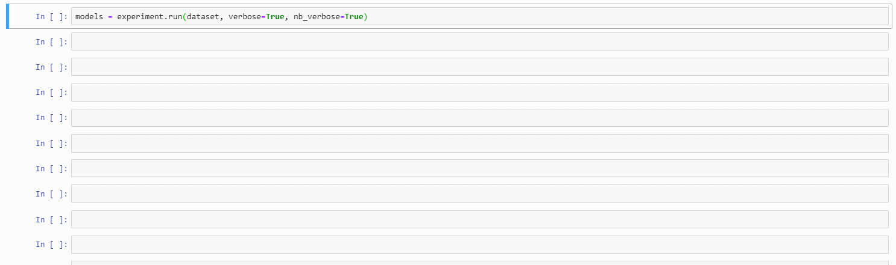

<h1 align="center">TopicNet</h2>

<div align="center">
    <a href="https://pypi.org/project/topicnet">
        
    </a>
    <a href="https://www.python.org/downloads/release/python-360/">
        
    </a>
    <a href="https://travis-ci.com/machine-intelligence-laboratory/TopicNet">
        
    </a>
    <a href="https://codecov.io/gh/machine-intelligence-laboratory/TopicNet">
        
    </a>
    <a href="https://github.com/machine-intelligence-laboratory/TopicNet/blob/master/LICENSE.txt">
        
    </a>
    <a href="https://github.com/machine-intelligence-laboratory/TopicNet/commits/master">
        
    </a>
</div>

<div align="center">
    A high-level interface developed by <a href="http://machine-intelligence.ru/en">Machine Intelligence Laboratory</a> for <a href="https://github.com/bigartm/bigartm">BigARTM</a> library.
</div>


## What is TopicNet

`TopicNet` library was created to assist in the task of building topic models.
It aims at automating model training routine freeing more time for artistic process of constructing a target functional for the task at hand.

Consider using TopicNet if:

* you want to explore BigARTM functionality without writing an overhead.
* you need help with rapid solution prototyping.
* you want to build a good topic model quickly (out-of-box, with default parameters).
* you have an ARTM model at hand and you want to explore it's topics.

`TopicNet` provides an infrastructure for your prototyping with the help of `Experiment` class and helps to observe results of your actions via [`viewers`](topicnet/viewers) module.

<p>
    <div align="center">
        
    </div>
    <em>
        Example of the two-stage experiment scheme.
        At the first stage, regularizer with parameter  taking values in some range  is applied.
        Best models after the first stage are <em>Model 1</em> and <em>Model 2</em> — so <em>Model 3</em> is not taking part in the training process anymore.
        The second stage is connected with another regularizer with parameter  taking values in range .
        As a result of this stage, two descendant models of <em>Model 1</em> and two descendant models of <em>Model 2</em> are obtained.
    </em>
</p>

And here is sample code of the TopicNet baseline experiment:

```python
from topicnet.cooking_machine.config_parser import build_experiment_environment_from_yaml_config
from topicnet.cooking_machine.recipes import ARTM_baseline as config_string


config_string = config_string.format(
    dataset_path      = '/data/datasets/NIPS/dataset.csv',
    modality_list     = ['@word'],
    main_modality     = '@word',
    specific_topics   = [f'spc_topic_{i}' for i in range(19)],
    background_topics = [f'bcg_topic_{i}' for i in range( 1)],
)
experiment, dataset = (
    build_experiment_environment_from_yaml_config(
        yaml_string   = config_string,
        experiment_id = 'sample_config',
        save_path     = 'sample_save_folder_path',
    )
)
experiment.run(dataset)
best_model = experiment.select('PerplexityScore@all -> min')[0]
```


## How to Start

Define `TopicModel` from an ARTM model at hand or with help from `model_constructor` module, where you can set models main parameters. Then create an `Experiment`, assigning a root position to this model and path to store your experiment. Further, you can define a set of training stages by the functionality provided by the `cooking_machine.cubes` module.

Further you can read documentation [here](https://machine-intelligence-laboratory.github.io/TopicNet/).


## Installation

**Core library functionality is based on BigARTM library**.
So BigARTM should also be installed on the machine.
Fortunately, the installation process should not be so difficult now.
Below are the detailed explanations.


### Via Pip

The easiest way to install everything is via `pip` (but currently works fine only for Linux users!)

```bash
pip install topicnet
```

The command also installs BigARTM library, not only TopicNet.
However, [BigARTM Command Line Utility](https://bigartm.readthedocs.io/en/stable/tutorials/bigartm_cli.html) will not be assembled.
Pip installation makes it possible to use BigARTM only through Python Interface.

If working on Windows or Mac, you should install BigARTM by yourself first, then `pip install topicnet` will work just fine.
We are hoping to bring all-in-`pip` installation support to the mentioned systems.
However, right now you may find the following guide useful.

### BigARTM for Non-Linux Users

To avoid installing BigARTM you can use [docker images](https://hub.docker.com/r/xtonev/bigartm/tags) with preinstalled different versions of BigARTM library:

```bash
docker pull xtonev/bigartm:v0.10.0
docker run -t -i xtonev/bigartm:v0.10.0
```

Checking if all installed successfully:

```bash
$ python

>>> import artm
>>> artm.version()
```

Alternatively, you can follow [BigARTM installation manual](https://bigartm.readthedocs.io/en/stable/installation/index.html).
There is also a pair of tips which may provide additional help for Windows users:

1. Go to the [installation page for Windows](http://docs.bigartm.org/en/stable/installation/windows.html) and download the 7z archive in the Downloads section.
2. Use Anaconda `conda install` to download all the Python packages that BigARTM requires.
3. Path variables must be set through the GUI window of system variables, and, if the variable `PYTHONPATH` is missing — add it to the **system wide** variables. Close the GUI window.

After setting up the environment you can fork this repository or use `pip install topicnet` to install the library.


### From Source

One can also install the library from GitHub, which may give more flexibility in developing (for example, making one's own viewers or regularizers a part of the module as .py files)

```bash
git clone https://github.com/machine-intelligence-laboratory/TopicNet.git
cd topicnet
pip install .
```

### Google Colab & Kaggle Notebooks

As Linux installation may be done solely using `pip`, TopicNet can be used in such online services as
[Google Colab](https://colab.research.google.com) and
[Kaggle Notebooks](https://www.kaggle.com/kernels).
All you need is to run the following command in a notebook cell:

```bash
! pip install topicnet
```

There is also a [notebook in Google Colab](https://colab.research.google.com/drive/1Tr1ZO03iPufj11HtIH3JjaWWU1Wyxkzv) made by [Nikolay Gerasimenko](https://github.com/Nikolay-Gerasimenko), where BigARTM is build from source.
This may be useful, for example, if you want to use the BigARTM Command Line Utility.


# Usage

Let's say you have a handful of raw text mined from some source and you want to perform some topic modelling on them.
Where should you start?

## Data Preparation

Every ML problem starts with data preprocess step.
TopicNet does not perform data preprocessing itself.
Instead, it demands data being prepared by the user and loaded via [Dataset](topicnet/cooking_machine/dataset.py) class.
Here is a basic example of how one can achieve that: [rtl_wiki_preprocessing](topicnet/demos/RTL-Wiki-Preprocessing.ipynb).

## Training a Topic Model

Here we can finally get on the main part: making your own, best of them all, manually crafted Topic Model

### Get Your Data

We need to load our data prepared previously with Dataset:

```python
DATASET_PATH = '/Wiki_raw_set/wiki_data.csv'
dataset = Dataset(DATASET_PATH)
```

### Make an Initial Model

In case you want to start from a fresh model we suggest you use this code:

```python
from topicnet.cooking_machine.model_constructor import init_simple_default_model

artm_model = init_simple_default_model(
    dataset=dataset,
    modalities_to_use={'@lemmatized': 1.0, '@bigram':0.5},
    main_modality='@lemmatized',
    specific_topics=14,
    background_topics=1,
)
```

Note that here we have model with two modalities: `'@lemmatized'` and `'@bigram'`.
Further, if needed, one can define a custom score to be calculated during the model training.

```python
from topicnet.cooking_machine.models.base_score import BaseScore


class CustomScore(BaseScore):
    def __init__(self):
        super().__init__()

    def call(self,
             model,
             eps=1e-5,
             n_specific_topics=14):

        phi = model.get_phi().values[:,:n_specific_topics]
        specific_sparsity = np.sum(phi < eps) / np.sum(phi < 1)

        return specific_sparsity
```

Now, `TopicModel` with custom score can be defined:

```python
from topicnet.cooking_machine.models.topic_model import TopicModel


custom_scores = {'SpecificSparsity': CustomScore()}
topic_model = TopicModel(artm_model, model_id='Groot', custom_scores=custom_scores)
```

### Define an Experiment

For further model training and tuning `Experiment` is necessary:

```python
from topicnet.cooking_machine.experiment import Experiment


experiment = Experiment(experiment_id="simple_experiment", save_path="experiments", topic_model=topic_model)
```

### Toy with the Cubes

Defining a next stage of the model training to select a decorrelator parameter:

```python
from topicnet.cooking_machine.cubes import RegularizersModifierCube


my_first_cube = RegularizersModifierCube(
    num_iter=5,
    tracked_score_function='PerplexityScore@lemmatized',
    regularizer_parameters={
        'regularizer': artm.DecorrelatorPhiRegularizer(name='decorrelation_phi', tau=1),
        'tau_grid': [0,1,2,3,4,5],
    },
    reg_search='grid',
    verbose=True,
)

my_first_cube(topic_model, dataset)
```

Selecting a model with best perplexity score:

```python
perplexity_criterion = 'PerplexityScore@lemmatized -> min COLLECT 1'
best_model = experiment.select(perplexity_criterion)
```

### Alternatively: Use Recipes

If you need a topic model now, you can use one of the code snippets we call *recipes*.
```python
from topicnet.cooking_machine.recipes import BaselineRecipe


training_pipeline = BaselineRecipe()
EXPERIMENT_PATH = '/home/user/experiment/'

training_pipeline.format_recipe(dataset_path=DATASET_PATH)
experiment, dataset = training_pipeline.build_experiment_environment(save_path=EXPERIMENT_PATH,)
```
after that you can expect a following result:



### View the Results

Browsing the model is easy: create a viewer and call its `view()` method (or `view_from_jupyter()` — it is advised to use it if working in Jupyter Notebook):

```python
from topicnet.viewers import TopTokensViewer


toptok_viewer = TopTokensViewer(best_model, num_top_tokens=10, method='phi')
toptok_viewer.view_from_jupyter()
```

More info about different viewers is available here: [`viewers`](topicnet/viewers).

# FAQ

### In the example we used to write vw modality like **@modality**, is it a VowpallWabbit format?

It is a convention to write data designating modalities with @ sign taken by TopicNet from BigARTM.

### CubeCreator helps to perform a grid search over initial model parameters. How can I do it with modalities?

Modality search space can be defined using standart library logic like:

```python
class_ids_cube = CubeCreator(
    num_iter=5,
    parameters: [
        name: 'class_ids',
        values: {
            '@text':   [1, 2, 3],
            '@ngrams': [4, 5, 6],
        },
    ]
    reg_search='grid',
    verbose=True,
)
```

However, for the case of modalities a couple of slightly more convenient methods are availiable:

```python
parameters : [
    {
        'name'  : 'class_ids@text',
        'values': [1, 2, 3]
    },
    {
        'name'  : 'class_ids@ngrams',
        'values': [4, 5, 6]
    }
]
parameters:[
    {
        'class_ids@text'  : [1, 2, 3],
        'class_ids@ngrams': [4, 5, 6]
    }
]
```
