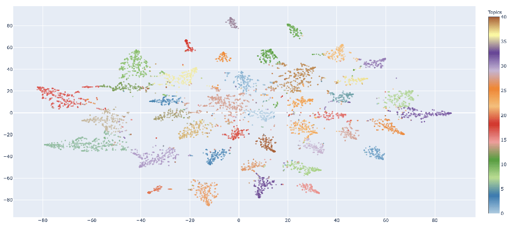
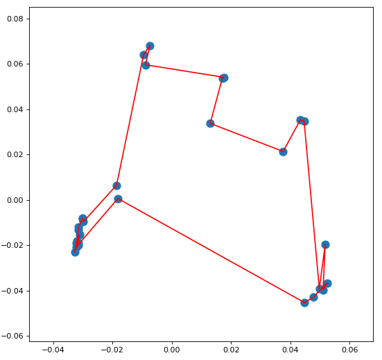
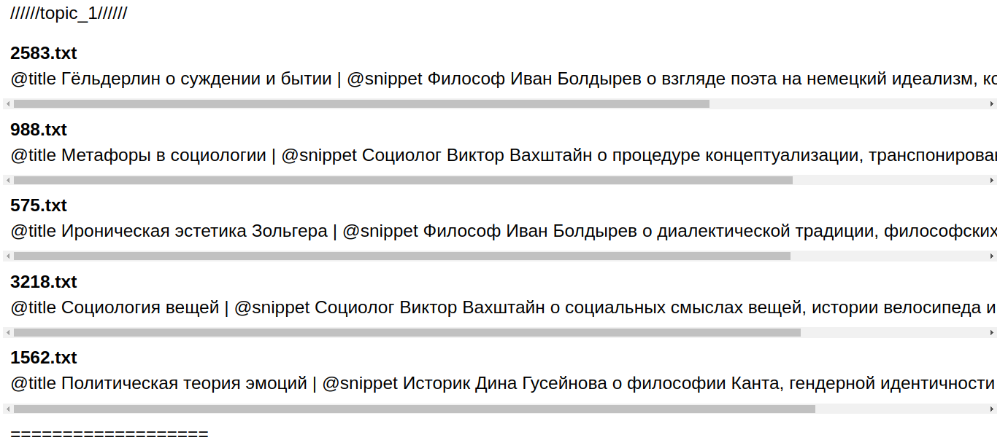
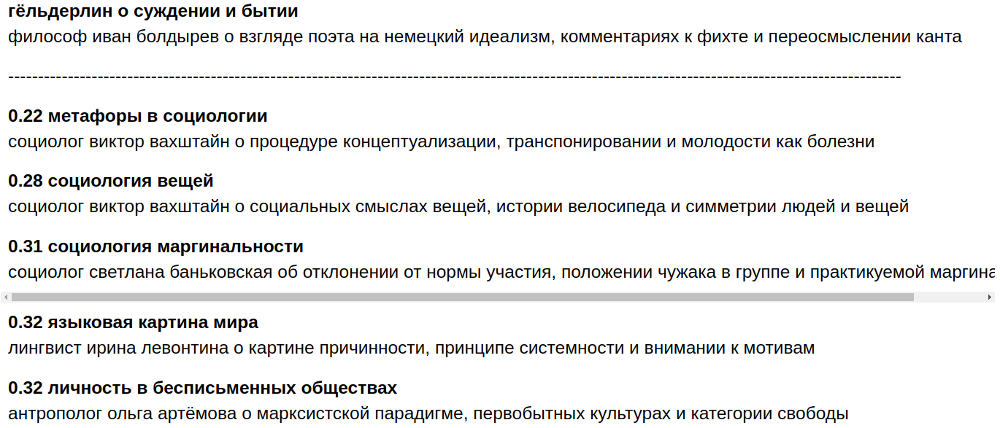
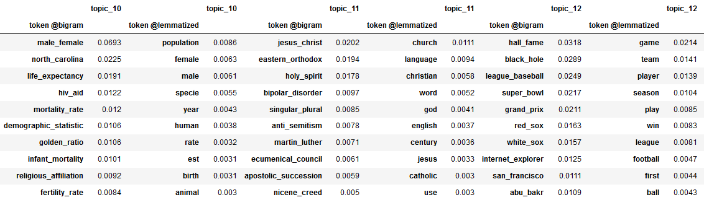
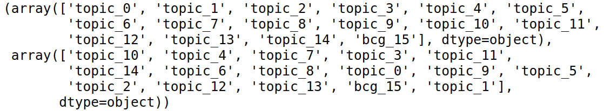

# Viewers

Module `viewers` provides information from a topic model allowing to estimate the model quality.
Its advantage is in unified call ifrastucture to the topic model making the routine and tedious task of extracting the information easy.

Currently module contains the following viewers:

* `base_viewer` (`BaseViewer`) — module responsible for base infrastructure.

* `document_cluster` (`DocumentClusterViewer`) — module which allows to visualize collection documents. May be slow for large document collections as it uses TSNE algorithm from [sklearn](https://scikit-learn.org/stable/modules/generated/sklearn.manifold.TSNE.html) library.

    

        
    

    

        <em>
            Visualisation of reduced document embeddings colored according to their topicspic made by DocumentClusterViewer.
        </em>
    

* `spectrum` (`TopicSpectrumViewer`) — module contains heuristics for solving TSP to arrange topics minimizing total distance of the spectrum.

    

        
    

    <em>
        Each point on the plot represents some topic.
        The viewer helped to calculate such a route between topics when one topic is connected with similar one, and so on, forming a circle.
    </em>

* `top_documents_viewer` (`TopDocumentsViewer`) — module with functions that work with dataset document collections.

    

        
    

    <em>
        The viewer shows fragments of top documents corresponding to some topic.
    </em>

* `top_similar_documents_viewer` (`TopSimilarDocumentsViewer`) — module containing class for finding similar document for a given one. This viewer helps to estimate homogeneity of clusters given by the model.

    

        
    

    <em>
        Some document from text collection (on top), and documents nearest to it given topic model.
        The viewer (currently) gives only document names as output, but the picture is not very difficult to be made.
    </em>

* `top_tokens_viewer` (`TopTokensViewer`) — module with class for displaying the most relevant tokens in each topic of the model.

    

        
    

    <em>
        Output of the TopTokensViewer. Token score in the topic is calculated for every token, score function can be specified at the stage of a viewer initialization.
    </em>

* `topic_mapping` (`TopicMapViewer`) — module allowing to compare topics between two different models trained on the same collection.

    

        
    

    <em>
        The mapping between topics of two models (currently only topic names are displayed).
    </em>

## Deprecated

* `initial_doc_to_topic_viewer` — first edition of `TopDocumentsViewer`

* `tokens_viewer` - first edition of `TopTokensViewer`
